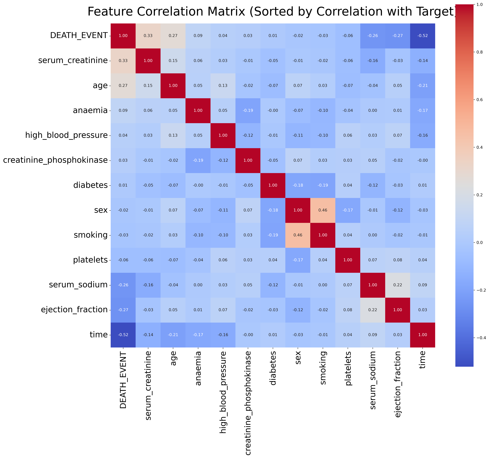
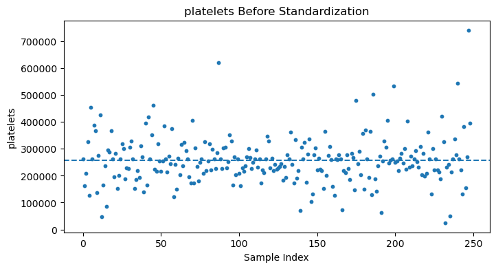
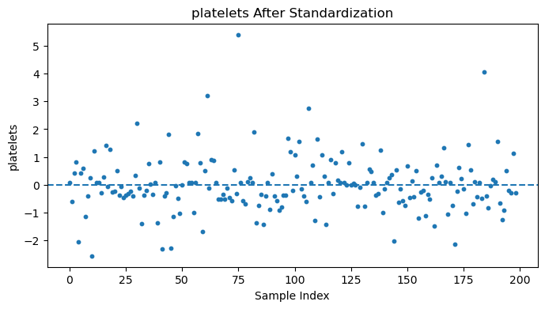
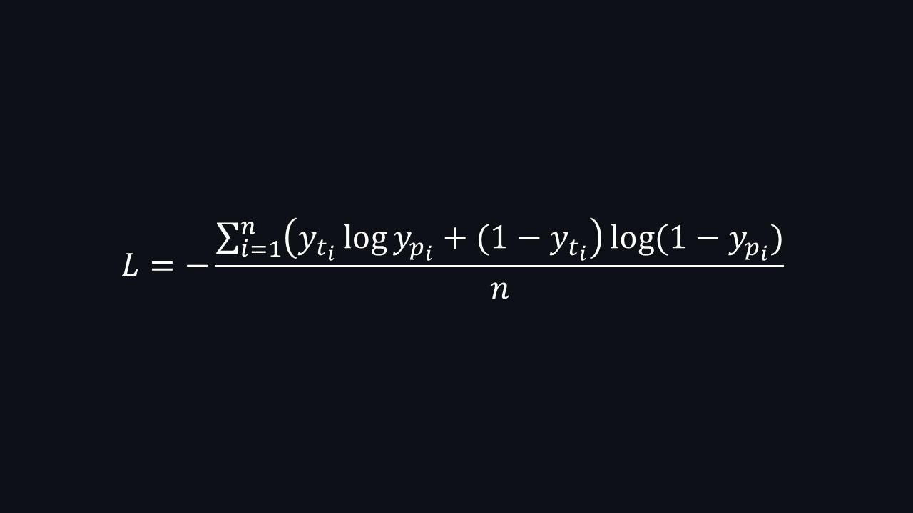
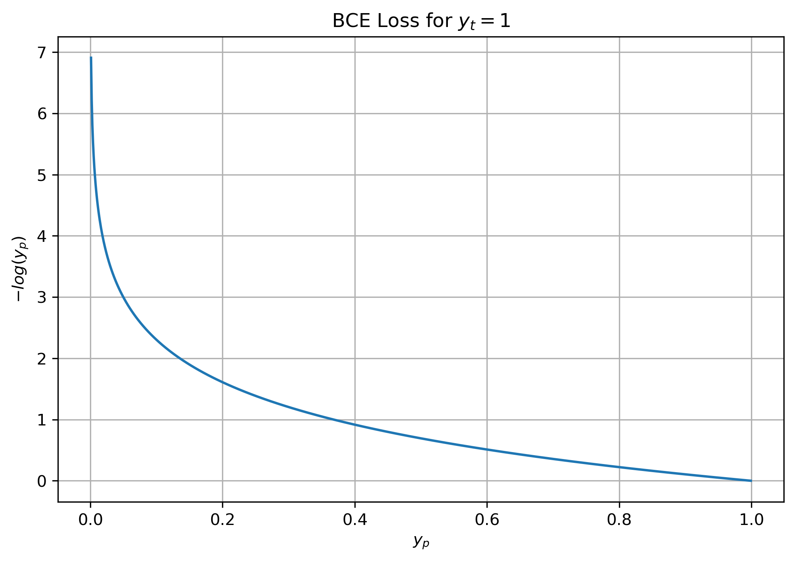
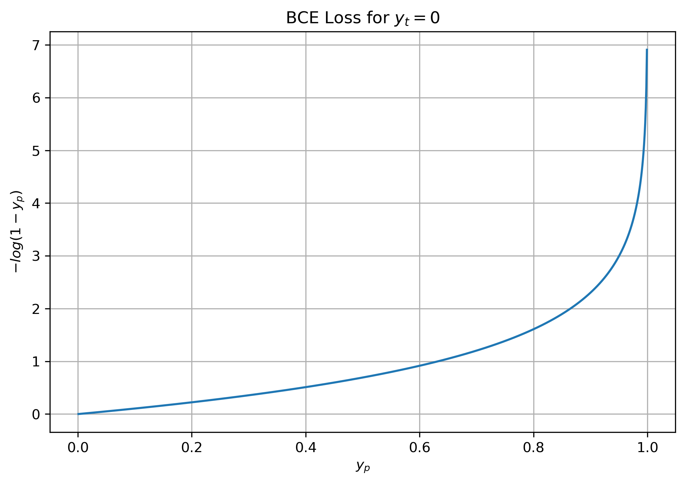

# Heart Failure Prediction using MLP Neural Network

## Overview

This project uses a Multi-Layer Perceptron (MLP) neural network to predict heart failure survival outcomes based on clinical records.

The objective is to apply deep learning techniques to healthcare data and evaluate the effectiveness of MLP models for medical risk prediction.

## Dataset

The dataset used in this project contains clinical records of heart failure patients.  
It includes multiple medical features that can help predict patient survival outcomes.

### Dataset Information

- Number of instances: 249
- Number of features: 12
- Target variable: `DEATH_EVENT`
- Task type: Binary Classification

### Features

| Feature | Description |
|---|---|
| age | Age of the patient |
| anaemia | Decrease of red blood cells or hemoglobin |
| creatinine_phosphokinase | Level of CPK enzyme in the blood |
| diabetes | Whether the patient has diabetes |
| ejection_fraction | Percentage of blood leaving the heart at each contraction |
| high_blood_pressure | Whether the patient has hypertension |
| platelets | Platelet count in the blood |
| serum_creatinine | Level of serum creatinine in the blood |
| serum_sodium | Level of serum sodium in the blood |
| sex | Gender of the patient |
| smoking | Whether the patient smokes |
| time | Follow-up period (days) |

### Target Variable

| Target | Meaning |
|---|---|
| 0 | Patient survived |
| 1 | Patient died |

## Project Structure

```text
heart-failure-risk-prediction/
├─ dataset/
│  ├─ test.csv
│  ├─ test_with_predictions.csv
│  ├─ train.csv
├─ experiments/
│  ├─ activation_function_experiment.ipynb
│  ├─ batch_size_experiment.ipynb
│  ├─ layer_experiment.ipynb
│  ├─ learning_rate_experiment.ipynb
├─ images
├─ saved_values
│  ├─ model.pth
│  ├─ variables.pt
├─ .gitignore
├─ dataset.zip  
├─ test.ipynb
├─ train.ipynb
```

### File Descriptions

| File / Folder | Description |
|---|---|
| `dataset/` | Contains dataset files used for training and testing |
| `dataset/train.csv` | Training dataset used for model learning |
| `dataset/test.csv` | Unlabeled dataset |
| `dataset/test_with_predictions.csv` | test.csv with labels |
| `experiments/` | Jupyter notebooks for hyperparameter experiments |
| `experiments/activation_function_experiment.ipynb` | Compare different activation functions and accuracy behavior |
| `experiments/batch_size_experiment.ipynb` | Compare different batch sizes and loss behavior |
| `experiments/layer_experiment.ipynb` | Compare different number of hidden layers and loss behavior |
| `experiments/learning_rate_experiment.ipynb` | Compare different learning rates and loss behavior |
| `images/` | Designed images for the project |
| `saved_values/` | Saved model and frequently used variables shared across project files |
| `saved_values/model.pth` | Trained model |
| `saved_values/variables.pt` | Saved variables |
| `train.ipynb` | Main notebook for training the MLP model |
| `test.ipynb` | Notebook for predictions |
| `dataset.zip` | Compressed version of the dataset folder |

## Data Preprocessing

### Feature Correlation Analysis

To better understand the relationships between features and the target variable (`DEATH_EVENT`), a correlation analysis was performed.

The heatmap below shows the correlation matrix sorted by correlation with the target variable:

<p align="center">
  
</p>

#### Key Observations

- `time` shows the strongest negative correlation with the target variable.
- `serum_creatinine` and `age` have moderate positive correlation with mortality.
- `ejection_fraction` and `serum_sodium` show negative correlation with death risk.
- Some features such as `diabetes`, `sex`, and `smoking` have very weak correlation with the target.

These observations help in understanding feature importance and the underlying structure of the dataset.

### Data Standardization

Centering and scaling the data plays an important role in improving the training stability and convergence speed of neural networks. When features have different scales, optimization becomes inefficient and may lead to unstable gradients.

As shown in the figure below, the distribution of the `platelets` feature has a large numerical range and is not centered around zero. The values are widely spread and have a high average (approximately 257,685).

<p align="center">
  
</p>

To address this issue, feature standardization is applied. Standardization transforms the data so that each feature has zero mean and unit variance, using the following formula:

X_standardized = (X - μ) / σ

where:
- μ is the mean of the training data
- σ is the standard deviation of the training data

In this project, standardization was implemented as follows:

```python
mu = torch.mean(x_train, dim=0)
std = torch.std(x_train, dim=0)

x_train = (x_train - mu) / std
x_valid = (x_valid - mu) / std
```

After applying standardization, the distribution of the `platelets` feature becomes centered around zero, as shown below:

<p align="center">
  
</p>

It can be observed that the transformed data has approximately zero mean and unit variance, which helps the model train more efficiently.

#### Important Note

It is important to highlight that the mean and standard deviation are computed **only from the training set** and then applied to both training and validation sets.

This is done to prevent data leakage, ensuring that information from the validation set does not influence the training process and leading to a more realistic evaluation of the model's performance.

## Training

### Model Architecture

The model used in this project is a Multi-Layer Perceptron (MLP) neural network implemented using PyTorch.

In the `train.ipynb` file, the main model architecture consists of:
- An input layer with 12 features
- A first hidden layer with 64 neurons
- A second hidden layer with 32 neurons
- An output layer with 1 neuron for binary classification

In addition to the main architecture, several experiments with different network depths were conducted in the `layer_experiment.ipynb` notebook.

The experiments included MLP models with:
- 2 hidden layers
- 3 hidden layers
- 4 hidden layers

The hidden layer sizes used in these experiments were:

```python
h1 = 64
h2 = 32
h3 = 16
h4 = 8
```

### Loss Function

Binary Cross Entropy Loss (`BCELoss`) was used as the loss function for binary classification.

<p align="center">
  
</p>

<p align="center">
  
  
</p>
