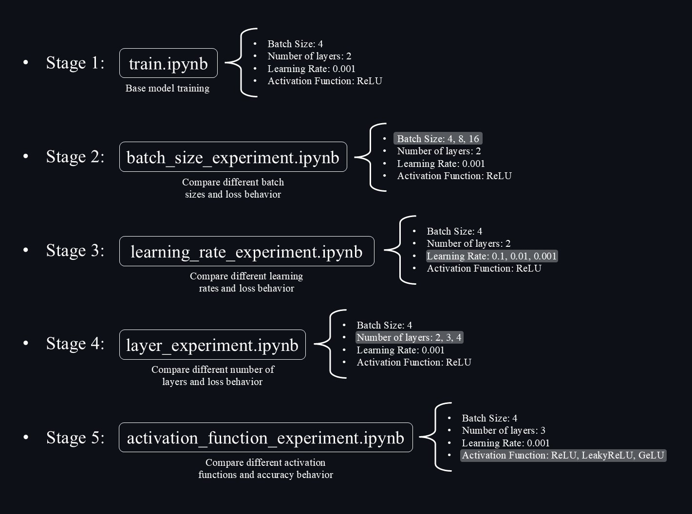
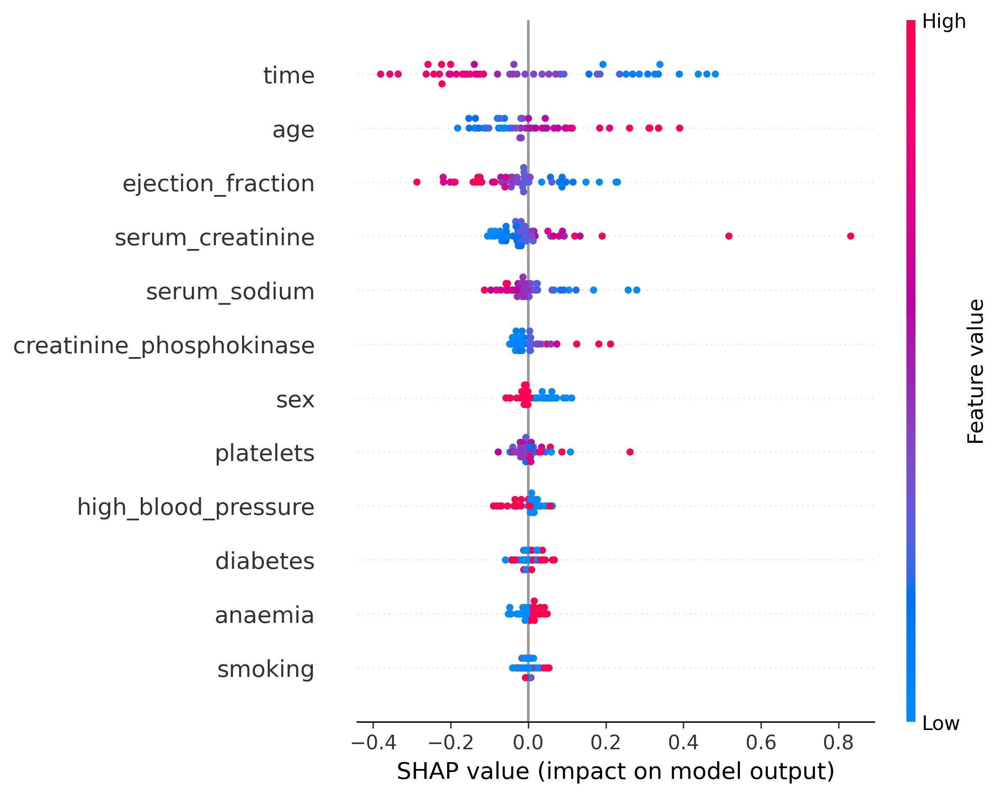
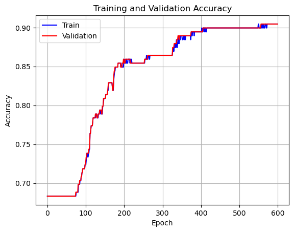
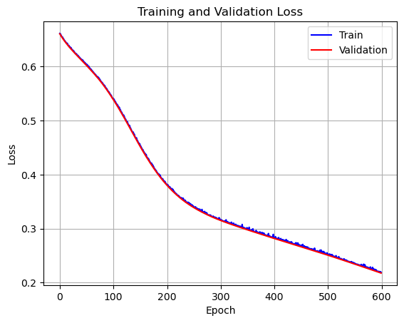
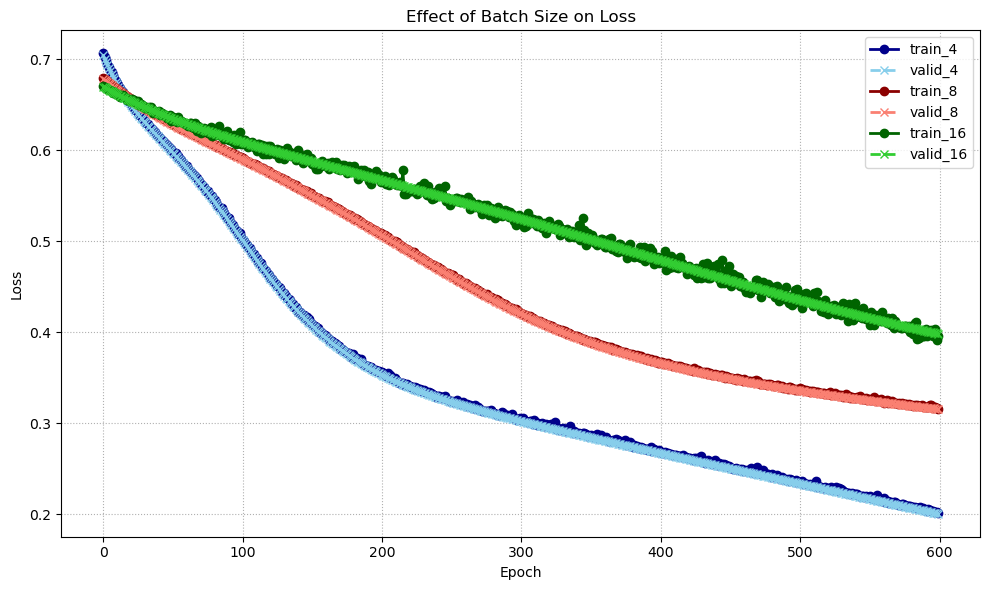
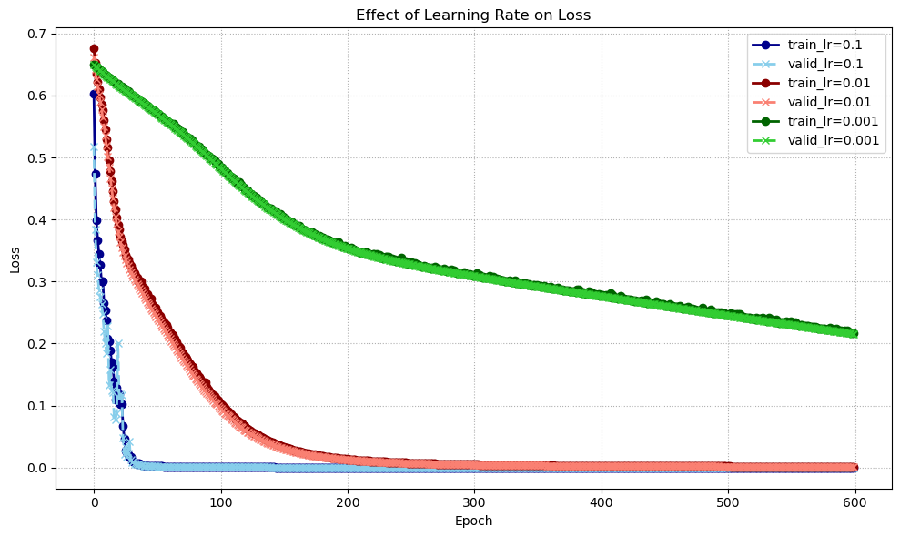
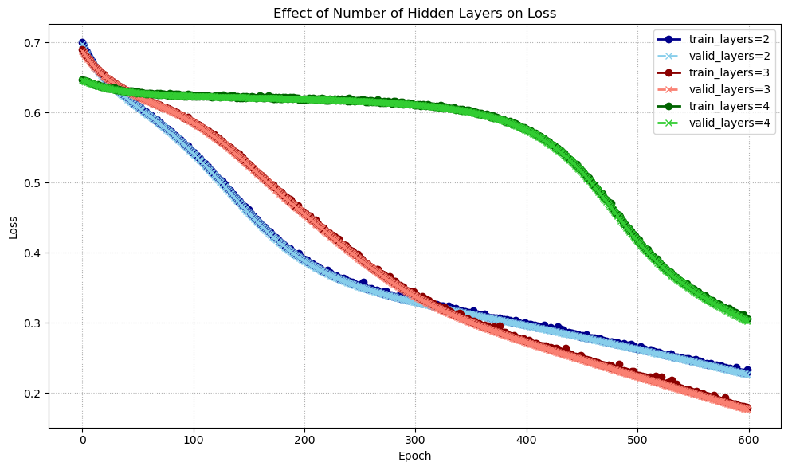
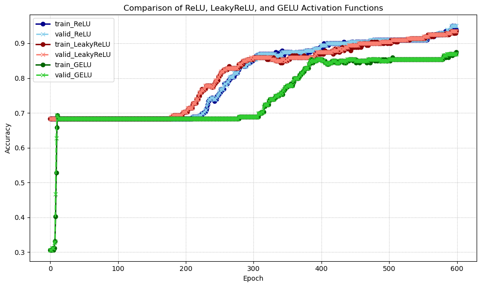

# Heart Failure Prediction using MLP Neural Network

## Overview

This project uses a Multi-Layer Perceptron (MLP) neural network to predict heart failure survival outcomes based on clinical records.

The objective is to apply deep learning techniques to healthcare data and evaluate the effectiveness of MLP models for medical risk prediction.

## Dataset

The dataset used in this project contains clinical records of heart failure patients.  
It includes multiple medical features that can help predict patient survival outcomes.

### Dataset Information

- Number of instances: 249
- Number of features: 12
- Target variable: `DEATH_EVENT`
- Task type: Binary Classification

### Features

| Feature | Description |
|---|---|
| age | Age of the patient |
| anaemia | Decrease of red blood cells or hemoglobin |
| creatinine_phosphokinase | Level of CPK enzyme in the blood |
| diabetes | Whether the patient has diabetes |
| ejection_fraction | Percentage of blood leaving the heart at each contraction |
| high_blood_pressure | Whether the patient has hypertension |
| platelets | Platelet count in the blood |
| serum_creatinine | Level of serum creatinine in the blood |
| serum_sodium | Level of serum sodium in the blood |
| sex | Gender of the patient |
| smoking | Whether the patient smokes |
| time | Follow-up period (days) |

### Target Variable

| Target | Meaning |
|---|---|
| 0 | Patient survived |
| 1 | Patient died |

## Project Structure

```text
heart-failure-risk-prediction/
├─ dataset/
│  ├─ test.csv
│  ├─ test_with_predictions.csv
│  │─ full_test.csv
│  ├─ train.csv
├─ experiments/
│  ├─ activation_function_experiment.ipynb
│  ├─ batch_size_experiment.ipynb
│  ├─ layer_experiment.ipynb
│  ├─ learning_rate_experiment.ipynb
├─ images
├─ saved_values
│  ├─ model.pth
│  ├─ variables.pt
├─ .gitignore
├─ dataset.zip  
├─ test.ipynb
├─ train.ipynb
```

### File Descriptions

| File / Folder | Description |
|---|---|
| `dataset/` | Contains dataset files used for training and testing |
| `dataset/train.csv` | Training dataset used for model learning |
| `dataset/test.csv` | Unlabeled dataset |
| `dataset/test_with_predictions.csv` | test.csv with predicted labels |
| `dataset/full_test.csv` | test.csv with currect labels |
| `experiments/` | Jupyter notebooks for hyperparameter experiments |
| `experiments/activation_function_experiment.ipynb` | Compare different activation functions and accuracy behavior |
| `experiments/batch_size_experiment.ipynb` | Compare different batch sizes and loss behavior |
| `experiments/layer_experiment.ipynb` | Compare different number of hidden layers and loss behavior |
| `experiments/learning_rate_experiment.ipynb` | Compare different learning rates and loss behavior |
| `images/` | Designed images for the project |
| `saved_values/` | Saved model and frequently used variables shared across project files |
| `saved_values/model.pth` | Trained model |
| `saved_values/variables.pt` | Saved variables |
| `train.ipynb` | Main notebook for training the MLP model |
| `test.ipynb` | Notebook for predictions |
| `dataset.zip` | Compressed version of the dataset folder |

## Data Preprocessing

### Correlation Matrix Analysis

To better understand the relationships between features and the target variable (`DEATH_EVENT`), a correlation analysis was performed.

The heatmap below shows the correlation matrix sorted by correlation with the target variable:

<p align="center">
  
</p>

#### Key Observations

- `time` shows the strongest negative correlation with the target variable.
- `serum_creatinine` and `age` have moderate positive correlation with mortality.
- `ejection_fraction` and `serum_sodium` show negative correlation with death risk.
- Some features such as `diabetes`, `sex`, and `smoking` have very weak correlation with the target.

These observations help in understanding feature importance and the underlying structure of the dataset.

---

### Data Standardization

Centering and scaling the data plays an important role in improving the training stability and convergence speed of neural networks. When features have different scales, optimization becomes inefficient and may lead to unstable gradients.

As shown in the figure below, the distribution of the `platelets` feature has a large numerical range and is not centered around zero. The values are widely spread and have a high average (approximately 257,685).

<p align="center">
  
</p>

To address this issue, feature standardization is applied. Standardization transforms the data so that each feature has zero mean and unit variance, using the following formula:

X_standardized = (X - μ) / σ

where:
- μ is the mean of the training data
- σ is the standard deviation of the training data

In this project, standardization was implemented as follows:

```python
mu = torch.mean(x_train, dim=0)
std = torch.std(x_train, dim=0)

x_train = (x_train - mu) / std
x_valid = (x_valid - mu) / std
```

After applying standardization, the distribution of the `platelets` feature becomes centered around zero, as shown below:

<p align="center">
  
</p>

It can be observed that the transformed data has approximately zero mean and unit variance, which helps the model train more efficiently.

#### Important Note

It is important to highlight that the mean and standard deviation are computed **only from the training set** and then applied to both training and validation sets.

This is done to prevent data leakage, ensuring that information from the validation set does not influence the training process and leading to a more realistic evaluation of the model's performance.

## Training

### Model Architecture

The model used in this project is a Multi-Layer Perceptron (MLP) neural network implemented using PyTorch.

In the `train.ipynb` file, the main model architecture consists of:
- An input layer with 12 features
- A first hidden layer with 64 neurons
- A second hidden layer with 32 neurons
- An output layer with 1 neuron for binary classification

In addition to the main architecture, several experiments with different network depths were conducted in the `layer_experiment.ipynb` notebook.

The experiments included MLP models with:
- 2 hidden layers
- 3 hidden layers
- 4 hidden layers

The hidden layer sizes used in these experiments were:

```python
h1 = 64
h2 = 32
h3 = 16
h4 = 8
```

All experiments and the main training process were conducted for 600 epochs.

---

### Activation Functions

In the `train.ipynb` notebook, the ReLU activation function was used between hidden layers of the MLP model.

In addition, several activation functions were evaluated in the `activation_function_experiment.ipynb` notebook to study their impact on model performance. These included:
- ReLU

<p align="center">
  
</p>

- LeakyReLU
  
<p align="center">
  
</p>

- GeLU

<p align="center">
  
</p>

It is important to note that in all experiments, the Sigmoid activation function was used in the output layer for binary classification.

---

### Batch Size

In the `train.ipynb` notebook, a batch size of `4` was used for the training set, while a batch size of `8` was used for the validation set.

To further investigate the effect of batch size on the training process, additional experiments were conducted in the `batch_size_experiment.ipynb` notebook using the following batch sizes:
- `4`
- `8`
- `16`

These experiments were performed to compare the training loss obtained with different batch sizes during model training.

---

### Loss Function

Binary Cross Entropy Loss (`BCELoss`) was used as the loss function for binary classification.

<p align="center">
  
</p>

<p align="center">
  
  
</p>

---

### Optimizer

Stochastic Gradient Descent (SGD) was used as the optimization algorithm for training the neural network.

The SGD parameter update rule is defined as:

<p align="center">
  
</p>

where:
- θ represents the model parameters
- η is the learning rate
- ∇θJ(θ) denotes the gradient of the loss function

In the `train.ipynb` notebook, the model was trained using a learning rate of `0.001`.

In addition, different learning rates were experimentally evaluated in the `learning_rate_experiment.ipynb` notebook, including:
- `0.1`
- `0.01`
- `0.001`

These experiments were conducted to analyze the effect of the learning rate on the training loss during the learning process.

<p align="center">
  
</p>

## Results and Analysis

### Data Analysis

#### Correlation Matrix Analysis

The correlation analysis provides insight into the linear relationship between each feature and the target variable (`DEATH_EVENT`).

It is important to note that correlation values only measure **linear relationships** and do not necessarily indicate causation or overall feature importance in nonlinear models such as neural networks.

#### Correlation with DEATH_EVENT

| Feature | Correlation | Interpretation |
|---|---|---|
| `time` | `-0.521597` | The strongest negative correlation in the dataset. Patients with longer follow-up periods are generally more likely to survive, resulting in lower mortality values. |
| `serum_creatinine` | `0.326138` | Moderate positive correlation with mortality. Higher serum creatinine levels are associated with poorer kidney function and increased risk of death. |
| `age` | `0.273166` | Moderate positive correlation. Older patients tend to have higher mortality risk due to weaker physiological condition and increased health complications. |
| `ejection_fraction` | `-0.268376` | Moderate negative correlation. Higher ejection fraction usually indicates better heart pumping efficiency and lower risk of death. |
| `serum_sodium` | `-0.256762` | Negative correlation with mortality. Lower serum sodium levels are often associated with worse heart failure conditions. |
| `anaemia` | `0.088886` | Weak positive correlation. Anaemia may contribute to cardiovascular complications, but its direct linear relationship with mortality is relatively small in this dataset. |
| `high_blood_pressure` | `0.044843` | Very weak positive correlation. Although hypertension is medically important, its isolated linear relationship with mortality is limited in this dataset. |
| `creatinine_phosphokinase` | `0.031485` | Very weak positive correlation. The feature may contain high variance and outliers, reducing its linear correlation with the target. |
| `diabetes` | `0.005338` | Almost no linear correlation observed. This does not imply that diabetes is unimportant, but rather that its relationship with mortality may be nonlinear or influenced by other variables. |
| `sex` | `-0.021182` | Very weak negative correlation. The dataset does not show a significant direct linear relationship between gender and mortality. |
| `smoking` | `-0.026766` | Very weak negative correlation. This does not imply that smoking reduces mortality risk. The result is likely influenced by dataset limitations, sample size, feature interactions, or hidden confounding factors. |
| `platelets` | `-0.063508` | Weak negative correlation. Platelet count alone does not show a strong linear relationship with mortality in this dataset. |

#### Important Observations

Some correlation values may appear inconsistent with established medical knowledge. For example, smoking is medically associated with cardiovascular disease, yet the dataset shows a weak negative correlation with mortality.

This can occur for several reasons:
- The dataset size is relatively small.
- Correlation measures only linear relationships.
- Multiple clinical variables interact with each other.
- Hidden confounding factors may influence the observed relationships.
- Neural networks can capture nonlinear patterns that are not visible in simple correlation analysis.

Therefore, correlation analysis should be interpreted as an exploratory statistical tool rather than a definitive measure of medical causality or feature importance.

### Feature Importance Analysis using SHAP

While correlation can highlight some general trends, it **cannot capture nonlinear relationships** or how features interact in a complex model like an MLP.

To better understand how the model makes predictions, I used **SHAP (SHapley Additive exPlanations)**. SHAP assigns an importance value to each feature for every individual prediction, helping me see **how each feature pushes the model's output higher or lower**.


<p align="center">
  
</p>

In other words:
- Each dot in the SHAP summary plot represents a single patient from the test data.
- The position along the x-axis shows whether the feature increases (right) or decreases (left) the predicted risk of death.
- The color of each dot represents the actual value of the feature (e.g., red for high values, blue for low values).
- Features are sorted vertically by their overall impact on model predictions.

> **Note:** This plot does **not** tell which feature is the most important overall. Instead, it shows **how each feature affects the model's decision for individual patients**.

---

### Training Phases and Hyperparameter Experiments

#### 1. Base Model Training


The base model training was performed in the `train.ipynb` notebook using the following hyperparameters:

- **Batch Size:** 4
- **Number of Hidden Layers:** 2
- **Learning Rate:** 0.001
- **Activation Function:** ReLU

##### Accuracy curve:

<p align="center">
  
</p>

##### Loss curve:

<p align="center">
  
</p>

#### Test Performance

The model was evaluated on the test set, achieving an accuracy of **69.3878%**.

The predicted labels for `DEATH_EVENT` were compared against the ground truth labels provided in the `full_test.csv` file to compute the final test accuracy.

> #### Base Model Analysis (Training, Validation, and Test Behavior)
>
> **Training Performance:**  
> The model achieved very high performance on the training set, with accuracy approaching **100%** and loss decreasing close to **0** as training progressed.
>
> **Validation Performance:**  
> A similar trend was observed on the validation set, where accuracy also approached **100%** and loss remained very low.
>
> The fact that both training and validation metrics improved simultaneously suggests that the model was able to fit the training distribution extremely well. However, this behavior does not necessarily guarantee strong generalization ability. In this case, it is likely influenced by the limited size of the dataset and the high similarity between training and validation splits, which may not fully represent unseen data diversity.
>
> **Interpretation:**  
> Although this could indicate effective learning, it may also reflect that the model is capturing dataset-specific patterns rather than robust general features. Due to the small dataset size, the validation set might not be sufficiently challenging to reliably estimate generalization performance.
>
> **Test Performance:**  
> In contrast, the model achieved only **69.3878% accuracy** on the test set, where predictions were compared against the ground truth labels in `full_test.csv`.
>
> This noticeable drop suggests that the model does not generalize well to truly unseen data. A likely reason is the limited dataset size, which can lead to overly optimistic validation results and reduced robustness on independent test samples. Other possible factors include dataset distribution differences and the model’s capacity being high relative to the available data.

#### 2. Batch Size Experiment

In the `batch_size_experiment.ipynb` notebook, the model was trained using batch sizes of **4**, **8**, and **16** to analyze their effect on the training process.

The other hyperparameters were kept constant:

- **Number of Hidden Layers:** 2
- **Learning Rate:** 0.001
- **Activation Function:** ReLU

##### Loss curve:

<p align="center">
  
</p>

#### 3. Learning Rate Experiment

In the `learning_rate_experiment.ipynb` notebook, the model was trained using learning rates of **0.1**, **0.01**, and **0.001** to analyze their effect on the training process.

The remaining hyperparameters were kept constant during the experiments:

- **Batch Size:** 4
- **Number of Hidden Layers:** 2
- **Activation Function:** ReLU

##### Loss curve:

<p align="center">
  
</p>

#### 4. Hidden Layer Experiment


In the `layer_experiment.ipynb` notebook, the model was trained using **2**, **3**, and **4** hidden layers to analyze the effect of network depth on the training process.

The remaining hyperparameters were kept constant during the experiments:

- **Batch Size:** 4
- **Learning Rate:** 0.001
- **Activation Function:** ReLU

##### Loss curve:

<p align="center">
  
</p>

#### 5. Activation Function Experiment

In the `activation_function_experiment.ipynb` notebook, the model was trained using the **ReLU**, **LeakyReLU**, and **GeLU** activation functions to analyze their effect on the training process.

The remaining hyperparameters were kept constant during the experiments:

- **Batch Size:** 4
- **Number of Hidden Layers:** 3
- **Learning Rate:** 0.001

##### Accuracy curve:

<p align="center">
  
</p>

## Future Improvements

The first and most important step for improving this project would be collecting a larger dataset in order to enhance the model’s generalization ability and overall performance.

In case the project moves toward a production or commercial phase, additional techniques such as regularization methods (e.g., dropout) and other optimization strategies will be considered to further improve model robustness and accuracy.
